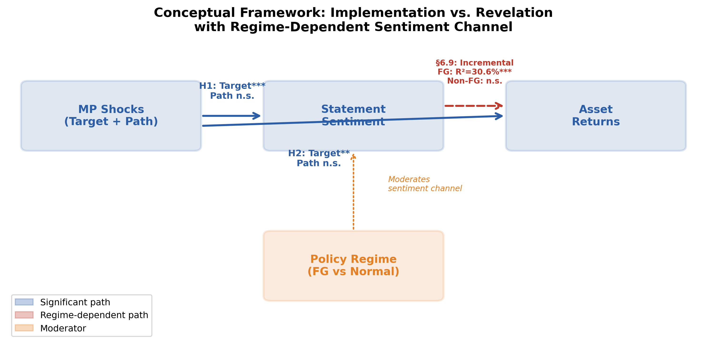
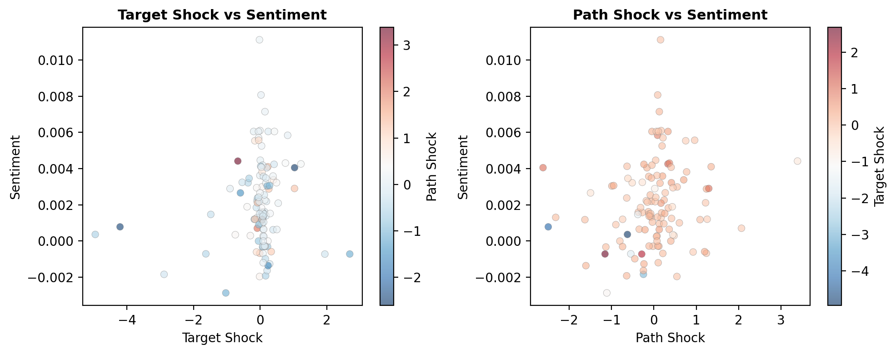
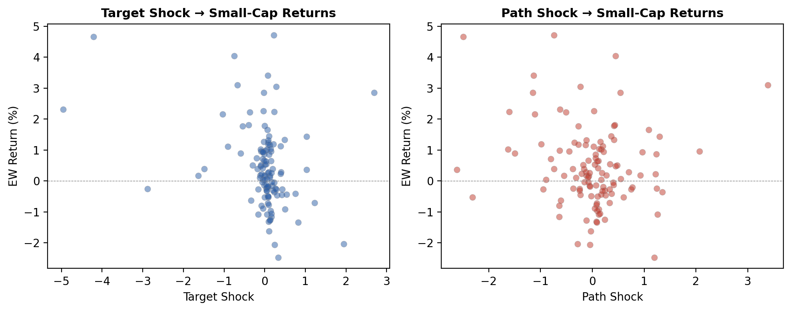
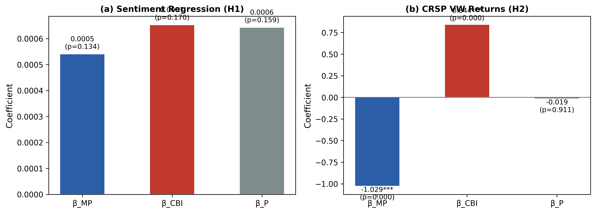
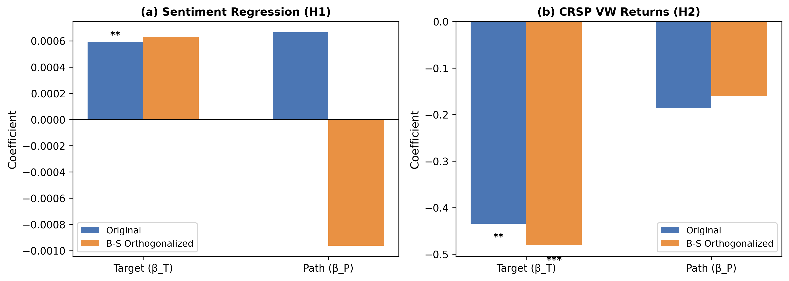
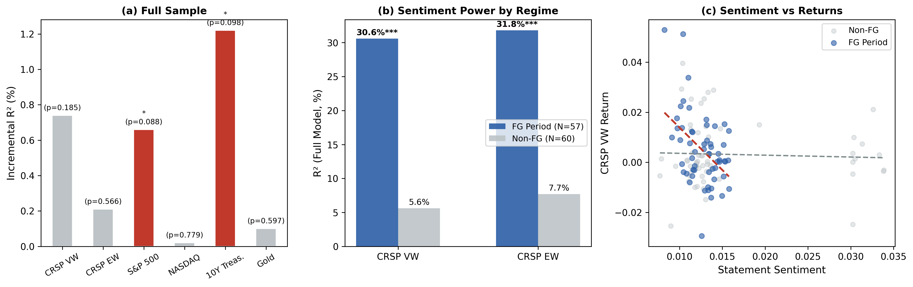

**Words Beyond the Rate: High-Frequency Monetary Policy Shocks and FOMC Language**

**Abstract**

Does FOMC statement language primarily reflect current monetary policy implementation or forward-looking informational revelation about future economic conditions? This paper examines this question using high-frequency monetary policy shocks derived from the Gürkaynak-Sack-Swanson (GSS) decomposition together with textual sentiment analysis of FOMC statements from 2006 - 2022.

The analysis shows that target shocks are more consistently associated with FOMC statement sentiment than path shocks, while path effects are generally weaker and sensitive to specification. Cross-asset evidence further indicates stronger responses among small-cap equities than large-cap equities, consistent with heterogeneous monetary transmission through financing conditions and discount-rate channels. Treasury and forward-guidance-related effects are comparatively limited in daily-frequency specifications.

Importantly, the paper does not interpret the GSS path factor as a pure information shock in the Jarociński-Karadi (2020) sense. Rather, the path factor captures revisions to expected future policy expectations that may reflect a combination of forward guidance, informational revelation, and expectation-related mechanisms.

Overall, the findings suggest that FOMC statement sentiment appears more closely tied to current policy implementation and financing conditions than to strong forward-looking informational revelation. More broadly, the paper contributes to the monetary policy communication literature by treating FOMC language as an endogenous output shaped by policy conditions rather than as a purely exogenous explanatory variable.

**Keywords**: Monetary policy, FOMC, Forward guidance, Sentiment analysis, High-frequency identification

JEL Classification: E43, E52, E58, G12, G14

**1. Introduction**

Central bank communication has become an increasingly important instrument of monetary policy. Over the past two decades, FOMC statements have evolved from brief post-meeting announcements into detailed policy communications designed to shape market expectations regarding inflation, economic conditions, and future interest-rate paths. Modern monetary policy therefore operates not only through current policy actions, but also through communication itself.

Yet an important question remains unresolved:

***Does FOMC statement language primarily reflect current policy implementation, or does it reveal forward-looking information about future economic conditions?***

This distinction is central to the interpretation of monetary policy transmission. If FOMC language primarily reflects current policy implementation, then statement sentiment should be most closely associated with unexpected current-rate decisions. If, instead, FOMC communication primarily reveals information about future economic conditions, then revisions to expected future policy paths should play a more important role.

A large literature studies how financial markets respond to monetary policy announcements. High-frequency identification studies show that unexpected monetary policy shocks significantly affect equities, Treasury yields, and other financial assets (Kuttner, 2001; Gürkaynak, Sack, and Swanson, 2005a). More recent work emphasizes the information channel of monetary policy, arguing that central bank announcements may reveal information about future economic conditions (Campbell et al., 2012; Nakamura and Steinsson, 2018; Jarociński and Karadi, 2020). At the same time, an expanding communication literature applies textual analysis and sentiment methods to central bank language (Lucca and Trebbi, 2009; Apel and Blix, 2014).

However, relatively little attention has been devoted to a more fundamental question:

***What determines the language itself?***

Unlike most prior work, which studies how markets respond to FOMC communication, this paper studies what drives the language of the statements themselves. Rather than treating communication as a purely exogenous explanatory variable, the paper treats FOMC language as an endogenous output shaped by monetary policy conditions and policy surprises.

To study this question, the paper combines high-frequency monetary policy shocks with textual sentiment analysis of FOMC statements. Specifically, the analysis uses the Gürkaynak-Sack-Swanson (GSS) decomposition of monetary policy surprises into target shocks and path shocks. The target shock captures the unexpected component of the current policy-rate decision, while the path shock captures revisions to expected future policy paths.

Importantly, the GSS path factor should not be interpreted as a pure information shock in the Jarociński-Karadi (2020) sense. Rather, the path factor captures revisions to future policy expectations that may reflect forward guidance, informational revelation, or broader expectation-related mechanisms. This distinction is critical because the path factor may contain both commitment-related and information-related components.

The paper produces three main findings.

**First**, target shocks are more consistently associated with FOMC statement sentiment than path shocks. The target coefficient is statistically significant in baseline specifications, while the path coefficient is generally weaker and more sensitive to specification. Although a formal Wald test cannot reject coefficient equality ($p = 0.90$), the asymmetry is consistent across specifications: the target shock reaches conventional significance levels while the path shock does not. This pattern provides more support for the policy-implementation interpretation than for a strong informational-revelation interpretation, though the Wald test result counsels against overstatement of the target--path distinction.

**Second**, cross-asset responses are strongest among equities, particularly small-cap equities. The equal-weighted CRSP index responds more strongly than the value-weighted index and the S&P 500, consistent with heterogeneous monetary transmission through financing conditions and balance-sheet sensitivity among smaller firms.

**Third**, while the forward-guidance interaction with path shocks is not significant, statement sentiment itself has substantial incremental explanatory power for equity returns during the forward guidance period ($R^2 = 30.6\%$ for CRSP VW returns, $p = 0.004$), suggesting that language becomes the primary transmission channel when the conventional interest-rate tool is constrained at the zero lower bound.

Taken together, the results suggest that FOMC statement sentiment appears more closely tied to current policy implementation and financing conditions than to strong forward-looking informational revelation.

This paper contributes to the literature in four ways. First, it studies what drives FOMC statement language itself rather than treating communication as purely exogenous. Second, it integrates high-frequency monetary policy shocks, textual sentiment analysis, and cross-asset evidence within a unified empirical framework. Third, it provides evidence consistent with heterogeneous monetary transmission across asset classes and firm sizes. Fourth, it highlights the importance of properly identified monetary policy surprises in monetary policy communication studies.

The remainder of the paper proceeds as follows. Section 2 reviews the related literature. Section 3 describes the data and variable construction. Section 4 presents the empirical framework. Section 5 reports the main empirical results. Section 6 discusses robustness and extensions. Section 7 concludes.

**2. Literature Review**

***2.1 Monetary Policy Surprises and High-Frequency Identification***

The identification of exogenous monetary policy shocks has long been a central challenge in macroeconomics. Early approaches relied on narrative methods (Romer and Romer, 1989) or structural VARs (Christiano, Eichenbaum, and Evans, 1999), both of which depend on strong identifying assumptions regarding policy counterfactuals and economic timing relationships.

Kuttner (2001) introduced the high-frequency identification approach by using changes in federal funds futures around FOMC announcements to isolate the unexpected component of monetary policy decisions. The central insight is that only the unanticipated component of policy should affect asset prices contemporaneously. Kuttner shows that unexpected rate changes have economically significant effects on equities, while anticipated policy changes have comparatively limited effects.

Gürkaynak, Sack, and Swanson (2005a) extend this framework by decomposing monetary policy surprises into two dimensions: a target factor associated with the current policy-rate decision and a path factor associated with revisions to expected future policy paths. Their results demonstrate that future-policy revisions explain a substantial portion of long-term interest-rate movements and asset-price responses, highlighting the importance of forward guidance and expectations management in monetary transmission.

The GSS decomposition has since become a standard framework in empirical monetary economics. Swanson (2021) extends the target and path factors through 2019, while Acosta (2022) further extends the series through 2022, providing the shock data used in this paper.

More recently, Fernández-Fuertes (2025) develops a multi-agent LLM framework that processes Federal Reserve communications—Statements, Minutes, Beige Books, and press conferences—to construct narrative monetary policy surprises. By eliciting conditional expectations from the document timeline before each FOMC meeting, his LLM-based surprises produce theoretically consistent impulse responses and carry directional information about the policy path that high-frequency announcement surprises miss. Importantly for this paper, when Fernández-Fuertes projects his narrative surprise onto the GSS target/path factors (his Table 32), he finds a significant loading on the target factor ($\hat{\beta}_T = 0.047$, $p < 0.01$) but a near-zero loading on the path factor ($\hat{\beta}_P \approx 0$), with only 12.4% of narrative-surprise variance spanned by the two high-frequency factors. This result independently confirms the target-dominant pattern we document, albeit as a byproduct of his shock-construction exercise rather than as a research question. Our paper differs from Fernández-Fuertes in both objective and approach: he constructs a better shock measure, whereas we ask what FOMC language itself conveys and whether the information channel operates through statement sentiment.

Bauer and Swanson (2023) argue that high-frequency monetary policy surprises may be partially predictable using publicly available macroeconomic information released prior to FOMC meetings. This critique is important for interpretation because it implies that high-frequency surprises may contain endogenous information about economic conditions rather than purely exogenous policy innovations. Nevertheless, high-frequency identification remains one of the most widely used approaches for measuring monetary policy surprises because it substantially improves identification relative to simple realized rate changes.

***2.2 Central Bank Communication***

A growing literature examines how central bank communication affects financial markets and economic expectations. Blinder et al. (2008) argue that communication has become an increasingly important policy instrument because modern monetary policy operates largely through expectation management.

Lucca and Trebbi (2009) apply computational text analysis to FOMC statements and show that statement complexity and language affect financial-market responses. Subsequent research expands the use of textual analysis in central banking contexts.

Apel and Blix (2014) construct a hawkish-dovish sentiment index for the Swedish Riksbank, demonstrating that central-bank-specific dictionaries can capture meaningful variation in monetary policy language. Hansen, McMahon, and Prat (2018) study transparency and deliberation within FOMC communications, while Rosa (2011) finds that statement tone affects Treasury yields and exchange rates.

Most importantly for this paper, the communication literature generally studies how markets respond to central bank language. By contrast, this paper studies what determines the language itself. Rather than treating communication as a purely exogenous explanatory variable, the paper treats FOMC statement language as an endogenous output shaped by monetary policy conditions and policy surprises.

***2.3 The Information Channel of Monetary Policy***

The information-channel literature argues that monetary policy announcements may reveal information about future economic conditions in addition to implementing policy decisions.

Romer and Romer (2000) provide early evidence that the Federal Reserve possesses informational advantages regarding inflation and macroeconomic conditions. Campbell et al. (2012) distinguish between "Delphic" forward guidance, which reveals information about the Federal Reserve's economic outlook, and "Odyssean" forward guidance, which commits the central bank to a future policy path.

Nakamura and Steinsson (2018) show that monetary policy announcements significantly affect long-term expectations, which they interpret as evidence of informational effects. Jarociński and Karadi (2020) further separate monetary policy shocks from information shocks using sign restrictions, demonstrating that the two types of shocks generate opposite stock-market responses.

This paper relates to the information-channel literature but differs conceptually from the Jarociński-Karadi framework. Importantly, the GSS path factor should not be interpreted as a pure information shock. Rather, it captures revisions to expected future policy paths that may reflect informational revelation, forward-guidance commitment effects, or broader expectation-management mechanisms.

The paper therefore examines whether FOMC statement sentiment is more closely associated with current policy implementation (target shocks) or future-policy revisions (path shocks).

**2.4 Sentiment Analysis and Central Bank Language**

Sentiment analysis has become widely used in financial economics. The Loughran-McDonald (2011) dictionary remains the standard dictionary-based approach for financial text analysis, correcting several limitations associated with general-purpose sentiment dictionaries.

However, central bank communication presents unique challenges for sentiment analysis. FOMC statements are highly institutionalized documents that often maintain relatively positive or neutral language regardless of policy stance, creating positivity bias when standard financial dictionaries are applied to monetary-policy communication.

To address this issue, several studies construct central-bank-specific sentiment dictionaries designed to capture hawkish and dovish language more effectively (Apel and Blix, 2014; Tadle, 2022).

This paper adopts a combined approach that integrates a standard financial dictionary with a central-bank-specific sentiment dictionary. The objective is not to develop a new NLP methodology, but rather to use textual sentiment as a measurement tool for studying monetary policy communication.

More advanced contextual NLP approaches, including transformer-based models and large language models, may improve measurement precision in future research. Notably, Fernández-Fuertes (2025) employs a multi-agent LLM framework to extract probabilistic expectations from Fed communications, achieving substantially higher explanatory power than market-based measures. However, the relatively small size and highly institutionalized structure of the FOMC statement corpus make transparent dictionary-based methods appropriate for the present analysis. Moreover, our objective differs: we use sentiment as a measurement tool to study what drives FOMC language, not to construct a superior shock measure. The transparency and reproducibility of dictionary-based methods—any researcher with the data can replicate our results without API access to proprietary LLMs—provides a methodological complement to the more powerful but less transparent LLM approaches.

***2.5 Forward Guidance and the Zero Lower Bound***

The global financial crisis and zero lower bound period substantially increased the importance of forward guidance in monetary policy implementation. With short-term policy rates constrained near zero, the Federal Reserve increasingly relied on communication regarding the future path of interest rates as a policy instrument.

The forward-guidance period therefore provides a useful environment for examining whether statement sentiment becomes more strongly associated with future-policy-path revisions. However, the period also coincided with unusually high macroeconomic uncertainty and financial-market volatility, making it difficult to isolate communication effects from broader crisis-related dynamics.

***2.6 Heterogeneous Monetary Transmission Across Firm Size***

A substantial literature documents that monetary policy has heterogeneous effects across firms of different sizes. Gertler and Gilchrist (1994) show that smaller firms are more sensitive to monetary policy shocks due to greater dependence on external financing and bank credit.

More recent work emphasizes that firm-level differences in capital structure and financing conditions contribute to heterogeneous monetary-policy transmission (Jeenas, 2019). These findings imply that smaller firms should exhibit stronger sensitivity to monetary policy surprises than larger firms.

This literature provides the theoretical foundation for the paper's prediction that equal-weighted equity indices should respond more strongly to monetary policy shocks than value-weighted indices.

***2.7 Methodological Considerations***

Several methodological issues are important in monetary policy event studies.

First, the choice of event window affects identification precision. Narrow intraday windows provide cleaner identification of announcement effects, while daily-frequency returns may dilute some high-frequency information.

Second, unscheduled FOMC meetings may differ from scheduled meetings because they may convey additional information regarding economic urgency and financial conditions.

Third, the choice of monetary policy surprise measure has first-order implications for empirical results. As shown later in the paper, replacing high-frequency monetary policy shocks with simple realized rate changes substantially weakens explanatory power and statistical significance.

**3. Data and Variable Construction**

***3.1 Monetary Policy Shocks***

We use high-frequency monetary policy shocks from Acosta (2022), which extends the Gürkaynak-Sack-Swanson (GSS) decomposition through July 2022. The GSS framework decomposes monetary policy surprises into two dimensions:

-   Target shock: the unexpected component of the current policy-rate decision.

-   Path shock: revisions to expected future policy paths.

The target factor captures unexpected current-policy actions, while the path factor captures changes in market expectations regarding the future trajectory of monetary policy.

Importantly, the path factor should not be interpreted as a pure information shock in the Jarociński-Karadi (2020) sense. Rather, it reflects revisions to future policy expectations that may contain informational, forward-guidance, and expectation-management components.

The shocks are standardized to unit variance in the full Acosta sample. In our estimation sample (2006--2022), the standard deviations are 0.82 for the target shock and 0.80 for the path shock. We use the shocks as provided by Acosta without re-standardization to preserve comparability with the existing literature.

The correlation between the target and path shocks is 0.14 in our sample, confirming that the GSS decomposition successfully separates current-policy surprises from future-policy revisions.

***3.2 FOMC Statement Corpus***

We collect FOMC statements from January 2006 through March 2025 from the Federal Reserve's official website. Of the 140 statements collected, 117 overlap with the Acosta monetary policy shock data and form the primary estimation sample.

The sample spans three Federal Reserve Chairs:

-   Ben Bernanke,

-   Janet Yellen,

-   and Jerome Powell.

Over the sample period, FOMC statements became substantially longer and more detailed, reflecting the increasing importance of communication and forward guidance in modern monetary policy implementation.

The statements are cleaned and standardized for textual analysis by removing formatting elements and non-substantive institutional text.

***3.3 Sentiment Analysis***

We compute two sentiment scores for each FOMC statement:

**Loughran-McDonald (LM) score**: The fraction of positive words minus the fraction of negative words, using the Loughran and McDonald (2011) dictionary. The LM dictionary contains 354 positive and 2,329 negative terms in its master list, of which a subset appears in FOMC text. The score is computed as:

LMₜ = (Positive wordsₜ − Negative wordsₜ) / Total wordsₜ (1)

**Central Bank (CB) score**: A hawkish-dovish score computed using an expanded central bank-specific dictionary comprising 591 hawkish terms (e.g., \"tightening,\" \"inflationary pressures,\" \"vigilant\") and 222 dovish terms (e.g., \"accommodative,\" \"downside risks,\" \"labor market slack\"). The CB score is computed as:

CBₜ = (Hawkish wordsₜ − Dovish wordsₜ) / Total wordsₜ (2)

The CB dictionary was constructed by combining terms from the existing literature (Apel and Blix, 2014; Tadle, 2022) with additional terms identified through manual review of FOMC statements. The hawkish dictionary includes terms related to inflation concerns, tightening policy, and robust economic conditions, while the dovish dictionary includes terms related to accommodation, easing, and economic weakness.

**Combined score**: We use the equal-weighted average of the LM and CB scores as our primary sentiment measure:

Sₜ = 0.5 × LMₜ + 0.5 × CBₜ (3)

This follows the standard approach in the literature, but we note that the LM component exhibits a positivity bias for FOMC text (see Section 6). The equal-weighted combination is chosen for transparency and to avoid data-snooping concerns; as we show in Section 6.7, the CB score alone provides stronger results, but we prefer the combined score as our baseline specification.

***3.4 Market Returns***

We use CRSP daily market data obtained through WRDS as the primary source for equity returns.

The main equity measures are:

-   **CRSP value-weighted return (vwretd)**: a broad market return weighted by firm market capitalization.

-   **CRSP equal-weighted return (ewretd)**: an equal-weighted index that places greater weight on smaller firms.

-   **CRSP S&P 500 return (sprtrn)**: the standard large-cap benchmark.

The equal-**weighted** index is particularly useful for examining heterogeneous monetary transmission because smaller firms tend to be more sensitive to financing conditions and external borrowing costs.

We additionally collect:

-   gold prices,

-   10-year Treasury yields,

-   13-week Treasury bill yields,

-   and the VIX

from the Federal Reserve Economic Data (FRED) database.

CRSP is used instead of alternative retail-data sources because it provides delisting-adjusted returns, which are particularly important for equal-weighted indices that contain a larger proportion of smaller firms.

***3.5 Summary Statistics***

Table 1 reports the summary statistics for the key variables in our estimation sample.

**Table 1: Summary Statistics (N = 117, 2006--2022)**

  --------------------------------------------------------------------------------
  **Variable**            **Mean**      **Std**       **Min**        **Max**
  ----------------------- ------------- ------------- -------------- -------------
  Target shock            −0.022        0.823         −4.955         2.691

  Path shock              0.003         0.795         −2.615         3.389

  Combined sentiment      0.014         0.006         0.008          0.034

  LM score                0.041         0.008         0.031          0.071

  CB score                −0.013        0.005         −0.022         0.005

  Kuttner surprise (bp)   −0.449        3.076         −20.000        9.539
  --------------------------------------------------------------------------------

*Note: Target and path shocks from Acosta (2022), standardized to unit variance in the full sample (1995--2022). Combined sentiment = 0.5 × LM + 0.5 × CB. Kuttner surprise in basis points.*

Several features of the data deserve comment. First, the target and path shocks exhibit low correlation (0.14), confirming that the Gürkaynak-Sack-Swanson decomposition successfully separates current-policy surprises from future-policy revisions. Both shock series display substantial variation during periods of elevated monetary-policy uncertainty, including the global financial crisis and the COVID-19 period.

Second, the sentiment measures exhibit comparatively limited variation, reflecting the highly institutionalized nature of FOMC communication. The LM measure maintains a positive average level throughout the sample, consistent with the known positivity bias of general financial dictionaries when applied to central-bank communication. By contrast, the CB measure displays greater directional variation and more directly captures hawkish versus dovish policy language.

Third, the equal-weighted equity index exhibits greater sensitivity to monetary policy surprises than broader value-weighted indices, consistent with the view that smaller firms are more exposed to financing-condition channels of monetary-policy transmission.

Finally, the monetary policy shock measures retain substantial variation throughout the sample period, supporting the use of high-frequency identification for studying the relationship between monetary policy surprises, statement sentiment, and cross-asset financial-market responses.

**4. Empirical Methodology**

Figure 1 presents the conceptual framework guiding the analysis. FOMC announcements generate two dimensions of monetary policy surprises --- target shocks associated with unexpected current-rate decisions and path shocks associated with revisions to expected future policy paths. The paper examines whether these shocks predict FOMC statement sentiment and cross-asset financial-market responses. A further question, addressed in Section 6.9, is whether statement sentiment itself contains incremental information about asset returns beyond what the shocks capture, and whether this informational content varies across monetary policy regimes.

The central empirical question is whether FOMC statement language is more closely associated with current policy implementation or future-policy revisions. If statement sentiment primarily reflects current policy implementation, target shocks should be more strongly associated with language. If statement sentiment primarily reflects forward-looking informational revelation, path shocks should play a larger role.

The cross-asset analysis further evaluates whether monetary policy shocks affect different financial assets in ways consistent with distinct transmission channels, including discount-rate effects, financing conditions, and expectations channels.

{width="6.0in"}

*Figure 1: Conceptual Framework --- Implementation vs. Revelation with Regime-Dependent Sentiment Channel*

*Note: Solid blue arrows = significant paths (target shock predicts sentiment and returns); dashed red arrow = regime-dependent path (sentiment predicts returns in the FG period only); dotted orange arrow = moderator (policy regime conditions the sentiment--return relationship). Wald test $p = 0.90$ cannot reject equal target and path effects on sentiment.*

***4.1 Sentiment and Monetary Policy Shocks***

We estimate the following regression to test whether FOMC statement sentiment is related to monetary policy shocks:

Sₜ = α + β₁ · Targetₜ + β₂ · Pathₜ + εₜ (4)

where *Sₜ* is the combined sentiment score for FOMC meeting *t*, *Targetₜ* is the target shock, and *Pathₜ* is the path shock.

The regression examines whether statement sentiment is more closely associated with unexpected current-policy decisions or with revisions to expected future policy paths. If FOMC language primarily reflects current policy implementation, target shocks should exhibit stronger associations with sentiment. If statement language primarily reflects forward-looking informational revelation, path shocks should play a larger role.

We conduct Wald tests of coefficient equality to evaluate whether the target and path shocks exhibit statistically different associations with statement sentiment.

Importantly, the GSS path factor should not be interpreted as a pure information shock in the Jarociński-Karadi (2020) sense. Rather, it captures revisions to expected future policy paths that may reflect informational revelation, forward-guidance commitment effects, or broader expectation-management mechanisms.

***4.2 Asset Returns and Monetary Policy Shocks***

To examine how monetary policy surprises transmit across financial markets, we estimate the following event-study specification for each asset class:

Rₜ = α + β₁ · Targetₜ + β₂ · Pathₜ + εₜ (5)

The analysis includes:

-   CRSP value-weighted returns,

-   CRSP equal-weighted returns,

-   S&P 500 returns,

-   gold returns,

-   10-year Treasury yields,

-   and 13-week Treasury bill yields.

Different asset classes are interpreted as reflecting different monetary transmission channels. Broad equity-market responses are interpreted as evidence consistent with discount-rate effects, while stronger responses among equal-weighted equities are interpreted as evidence consistent with heterogeneous financing-condition channels affecting smaller firms more strongly than larger firms.

Treasury-yield responses are interpreted as reflecting revisions to future policy expectations and forward-guidance-related effects, while gold returns provide evidence related to inflation-hedge and monetary-uncertainty channels.

The comparison between value-weighted and equal-weighted equity returns is particularly important because it allows us to examine whether smaller firms exhibit greater sensitivity to monetary policy surprises than larger firms, consistent with the financing-channel literature.

The paper does not claim to structurally identify these mechanisms. Rather, the cross-asset evidence is interpreted as providing evidence broadly consistent with distinct monetary transmission channels.

***4.3 Relative Importance of Target and Path Shocks***

To evaluate whether FOMC statement sentiment is more closely associated with current policy implementation or future-policy revisions, we compare the relative magnitudes of the target and path coefficients in the baseline sentiment regression.

We conduct Wald tests of coefficient equality under the null hypothesis:

W = (β̂₁ − β̂₂)² / Var(β̂₁ − β̂₂) (6)

where *Var(\\hat{β₁ - \\hat{β₂) = Var(\\hat{β₁) + Var(\\hat{β₂) - 2Cov(\\hat{β₁, \\hat{β₂)* is estimated using the Newey-West variance-covariance matrix. Under the null hypothesis, *W* follows a *χ²* distribution with 1 degree of freedom.

Failure to reject the null hypothesis implies that the two shock dimensions exhibit statistically similar associations with statement sentiment, while rejection suggests differential relationships between current-policy surprises and future-policy revisions.

The Wald statistics are computed using the Newey-West variance-covariance matrix to account for potential heteroskedasticity and autocorrelation in the regression residuals.

***4.4 Forward Guidance Period Interaction***

To examine whether the relationship between statement sentiment and financial-market responses differs during the forward-guidance period, we estimate the following interaction specification:

Rₜ = α + β₁ · Targetₜ + β₂ · Pathₜ + β₃ · Sₜ + β₄ · (Sₜ × FGₜ) + εₜ (7)

where *FGₜ* is an indicator for the forward guidance period (December 2008 to December 2015, when the federal funds rate was at the zero lower bound). The interaction term evaluates whether statement sentiment exhibits stronger associations with asset returns during periods in which communication and expectation management became more central components of monetary policy implementation.

The forward-guidance period includes 48 of the 117 FOMC meetings in the estimation sample.

***4.5 Estimation***

All regressions are estimated using ordinary least squares with Newey-West heteroskedasticity and autocorrelation consistent (HAC) standard errors.

The use of HAC standard errors is motivated by the possibility of serial correlation and time-varying volatility in both financial-market returns and institutional communication data. As a robustness check, the paper also reports heteroskedasticity-robust standard errors. The main qualitative results remain broadly similar across specifications.

***4.6 Identification Assumptions***

Several identification issues should be acknowledged.

First, high-frequency monetary policy shocks may not be perfectly exogenous. The GSS framework assumes that narrow-window changes in interest-rate futures around FOMC announcements primarily reflect monetary policy surprises rather than other contemporaneous news. While this assumption is standard in the high-frequency identification literature, Bauer and Swanson (2023) show that monetary policy surprises may be partially predictable using publicly available macroeconomic information released prior to FOMC meetings.

Second, the empirical framework should be interpreted as identifying reduced-form associations rather than fully structural causal effects. Because FOMC statements and policy decisions are released simultaneously, the analysis cannot fully separate communication effects from broader policy-announcement effects.

Third, the regression specifications assume approximately linear relationships between monetary policy shocks, statement sentiment, and asset returns. Although nonlinear effects and regime dependence may exist, additional robustness analysis reported in Section 6 suggests that the main qualitative findings remain broadly similar across alternative specifications.

Finally, the relationship between monetary policy shocks and communication may vary across policy regimes and Federal Reserve Chairs. The paper therefore examines several subsample and regime-based specifications to evaluate the stability of the baseline results.

**5. Results**

***5.1 Sentiment and Monetary Policy Shocks***

Table 2 reports the baseline regression relating FOMC statement sentiment to monetary policy shocks.

The target shock exhibits a positive and statistically significant association with statement sentiment, while the path shock is positive but statistically insignificant. These results suggest that FOMC statement language is more closely associated with unexpected current-policy decisions than with revisions to expected future policy paths.

The explanatory power of the regression is modest ((R\^2 = 1.57%)), which is common in text-based financial regressions given the inherently noisy nature of institutional communication data.

A Wald test cannot reject the null hypothesis that the target and path coefficients are equal. Accordingly, the results should be interpreted cautiously. The evidence provides more support for the policy-implementation interpretation than for a strong informational-revelation interpretation, but does not conclusively eliminate informational effects.

**Table 2: Sentiment and Monetary Policy Shocks**

  --------------------------------------------------------------------------
  **Variable**    **β**           **SE**          **t**        **p**
  --------------- --------------- --------------- ------------ -------------
  Target shock    0.000577        0.000238        2.43         0.017

  Path shock      0.000633        0.000439        1.44         0.152

  Constant        0.0145          ---             ---          ---

  R²              1.57%                                        

  N               117                                          
  --------------------------------------------------------------------------

*Note: Newey-West HAC(4) standard errors. The dependent variable is the combined sentiment score (0.5 × LM + 0.5 × CB).*

{width="6.0in" height="1.890411198600175in"}

*Figure 2: Sentiment vs Monetary Policy Shocks*

Figure 2 illustrates the relationship between sentiment and monetary policy shocks. The target shock exhibits a visibly positive, though noisy, relationship with statement sentiment, while the path-shock relationship appears substantially weaker.

***5.2 Data Source Comparison***

Table 3 compares the baseline results across alternative measures of monetary policy surprises, including simple rate changes, the Kuttner (2001) surprise, and the GSS target-path decomposition.

The choice of monetary policy surprise measure substantially affects the empirical results. Replacing high-frequency shocks with simple realized rate changes weakens explanatory power and eliminates statistical significance. By contrast, the Kuttner surprise and the GSS decomposition produce economically meaningful and statistically significant relationships.

These findings highlight the importance of properly identified monetary policy surprises in communication studies. Simple realized rate changes combine anticipated and unanticipated policy components, introducing measurement noise that weakens the estimated relationship between monetary policy and communication.

**Table 3: Surprise Measure Comparison (Dependent Variable: Combined Sentiment)**

  -----------------------------------------------------------------------------------
  **Surprise Measure**    **β (t)**         **p**         **R²**        **N**
  ----------------------- ----------------- ------------- ------------- -------------
  Rate change             0.001902 (0.64)   0.525         0.40%         117

  Kuttner surprise (bp)   0.000234 (2.61)   0.009         1.49%         117

  GSS target shock        0.000577 (2.43)   0.017         1.57%         117
  -----------------------------------------------------------------------------------

*Note: The GSS specification includes both target and path shocks; R² is for the full model. Newey-West HAC(4) standard errors.*

***5.3 Asset Returns and Monetary Policy Shocks***

Table 4 reports cross-asset financial-market responses to monetary policy shocks.

The target shock produces economically meaningful declines across equity markets. The strongest responses occur in the CRSP equal-weighted index, followed by the value-weighted index and the S&P 500. This pattern is consistent with heterogeneous monetary transmission through financing conditions, where smaller firms are more sensitive to unexpected monetary tightening due to greater dependence on external financing and bank credit.

NASDAQ and gold also exhibit significant negative responses to target shocks, while Treasury-yield responses are comparatively weak in daily-frequency specifications.

The path shock does not produce statistically significant responses across most asset classes. While the coefficients are generally directionally consistent with theoretical expectations, the effects are substantially weaker and less precisely estimated than the target-shock responses.

**Table 4: Asset Returns and Monetary Policy Shocks (CRSP Data)**

  ----------------------------------------------------------------------------------------------
  **Asset**      **β_T**   **t_target**   **p_target**   **β_P**   **p_path**   **R²**   **N**
  -------------- --------- -------------- -------------- --------- ------------ -------- -------
  CRSP VW        −0.435    −2.05          0.043          −0.186    0.443        9.10%    117

  CRSP EW        −0.449    −2.53          0.013          −0.174    0.479        10.30%   117

  S&P 500        −0.391    −1.80          0.073          −0.179    0.424        7.80%    117

  NASDAQ         −0.282    −2.09          0.039          −0.166    0.309        3.40%    117

  Gold           −0.404    −2.47          0.014          −0.488    0.146        7.00%    117

  10Y Treasury   0.007     0.84           0.403          −0.001    0.89         0.70%    117

  13W T-bill     0.004     0.69           0.491          −0.003    0.737        0.70%    117
  ----------------------------------------------------------------------------------------------

*Note: Newey-West HAC(4) standard errors. Returns in basis points for equities and gold; percentage points for Treasury yields.*

An important pattern emerges from comparing the equity indices. The equal-weighted index responds more strongly than the value-weighted index and the S&P 500, consistent with the financing-channel literature emphasizing the greater sensitivity of smaller firms to monetary-policy shocks.

Treasury-yield responses are comparatively weak, likely reflecting the use of daily-frequency rather than narrow intraday event windows. Daily returns may dilute part of the high-frequency information embedded in monetary policy announcements.

{width="5.5in" height="2.9905435258092736in"}

*Figure 3: Asset Return Responses to Monetary Policy Shocks*

Figure 3 summarizes the cross-asset responses. The target shock generates consistently negative responses across equity markets and gold, while path-shock effects remain comparatively limited.

***5.4 Policy Implementation vs Informational Revelation***

The central question of the paper is whether FOMC statement language primarily reflects current policy implementation or forward-looking informational revelation.

Overall, the evidence favors the policy-implementation interpretation.

Target shocks are more consistently associated with statement sentiment and equity-market responses than path shocks. Cross-asset responses are strongest among equities, particularly equal-weighted equities, consistent with financing-condition and discount-rate channels.

By contrast, path-related effects are generally weaker and more sensitive to specification. Treasury and forward-guidance-related responses are comparatively limited in the daily-frequency regressions.

Importantly, however, the results should not be interpreted as rejecting the information channel more broadly. Federal Reserve communication extends beyond the post-meeting statement itself and includes:

-   press conferences,

-   Summary of Economic Projections releases,

-   speeches,

-   and broader expectation-management strategies.

Moreover, the GSS path factor is not a pure information shock in the Jarociński-Karadi sense. It captures revisions to expected future policy paths that may contain both informational and commitment-related components.

Accordingly, the evidence suggests that FOMC statement sentiment appears more closely tied to current policy implementation and financing conditions than to strong forward-looking informational revelation.

***5.5 Mechanism Analysis: Why Is the Target Shock More Empirically Relevant?***

Several interpretations may explain why target shocks are more consistently associated with statement sentiment than path shocks.

First, FOMC statements may primarily explain the rationale for the current policy decision rather than provide extensive forward guidance regarding future policy paths. Under this interpretation, current-policy surprises naturally exhibit stronger associations with statement language.

Second, forward guidance may operate through communication channels other than the statement text itself, including press conferences, speeches, and Summary of Economic Projections releases. If future-policy information is primarily transmitted through these broader communication channels, the path shock may affect market expectations without strongly affecting statement sentiment.

Third, dictionary-based sentiment measures may not fully capture subtle forms of informational communication embedded in central-bank language. Future-oriented information may be conveyed through conditional phrasing, semantic nuance, or probabilistic language that simple hawkish-dovish sentiment measures cannot fully detect.

Taken together, these interpretations suggest that the comparatively weak path-shock results may reflect both communication-channel differences and measurement limitations rather than the complete absence of informational effects.

***5.6 Forward Guidance Period Interaction***

We next examine whether the relationship between statement sentiment and financial-market responses differs during the zero lower bound and forward-guidance period.

Overall, we do not find robust evidence that statement sentiment becomes systematically more important during the forward-guidance period. Interaction effects are generally weak and sensitive to specification.

The interaction term is not significant in either specification (p = 0.836 for CRSP VW; p = 0.739 for NASDAQ), indicating that statement sentiment does not become systematically more important during the forward-guidance period.

Additional subsample analysis suggests some evidence of regime heterogeneity, particularly during rate-cut periods, where path shocks become more strongly associated with statement sentiment. However, these results are based on relatively small subsamples and should therefore be interpreted cautiously.

Overall, the full-sample results remain more robust than the regime-specific estimates.

**Table 5: Forward Guidance Period Interaction**

  -----------------------------------------------------------------------
  **Variable**            **CRSP VW**             **NASDAQ**
  ----------------------- ----------------------- -----------------------
  Target shock            −0.421                  −0.289

                          (0.046)                 (0.031)

  Path shock              −0.175                  −0.166

                          (0.452)                 (0.320)

  Sentiment               −20.73                  5.47

                          (0.191)                 (0.709)

  Sentiment × FG          −3.72                   6.04

                          (0.836)                 (0.739)

  R²                      9.9%                    3.5%

  N                       117                     117
  -----------------------------------------------------------------------

*Note: p-values in parentheses. Newey-West HAC(4) standard errors. FG = forward guidance period indicator (Dec 2008--Dec 2015). \\\*\\\*\\\* p\<0.01, \\\*\\\* p\<0.05, \\\* p\<0.1.*

***5.7 Economic Interpretation***

The results carry several broader implications for monetary-policy communication.

First, the findings suggest that current-policy implementation remains the dominant driver of FOMC statement sentiment, even in an era of increasing forward guidance and expectation management.

Second, the stronger responses among equal-weighted equities provide evidence consistent with heterogeneous monetary transmission through financing conditions and balance-sheet sensitivity among smaller firms.

Third, the comparatively weak Treasury and path-shock results suggest that some forward-guidance and informational effects may operate through channels not fully captured by daily-frequency statement sentiment measures.

More broadly, the results highlight the importance of distinguishing between:

-   current-policy surprises,

-   future-policy revisions,

-   and broader informational communication channels

when interpreting the relationship between monetary policy and financial markets.

**6. Robustness and Extensions**

***6.1 Alternative Standard Errors and Lag Structure***

To evaluate the sensitivity of the baseline results to standard-error estimation, we re-estimate the sentiment regressions using alternative Newey-West lag structures together with White heteroskedasticity-robust standard errors.

The main qualitative findings remain stable across specifications. The target shock remains statistically significant across alternative lag choices, while the path shock remains comparatively weak and generally insignificant. The similarity of the results across standard-error estimators suggests that the baseline findings are not driven by a particular autocorrelation correction.

Overall, the results support the robustness of the central finding that target shocks exhibit stronger associations with statement sentiment than path shocks.

***6.2 Alternative Monetary Policy Surprise Measures***

As an alternative to the GSS target-path decomposition, we estimate the sentiment regression using the Kuttner (2001) surprise measure and simple realized federal funds rate changes.

The Kuttner surprise remains positively and significantly associated with statement sentiment, producing results broadly consistent with the baseline specification. By contrast, replacing high-frequency surprises with realized rate changes substantially weakens explanatory power and eliminates statistical significance.

These findings highlight the importance of properly identified monetary policy surprises in communication studies. Simple rate changes combine anticipated and unanticipated policy components, introducing measurement noise that weakens the estimated relationship between monetary policy and communication.

***6.3 Excluding COVID***

To evaluate whether the baseline results are driven by the extreme volatility associated with the COVID-19 crisis, we re-estimate the baseline specification excluding the March--June 2020 period.

The results remain broadly unchanged. The target shock remains statistically significant, while the path shock remains comparatively weak and statistically insignificant.

This robustness check suggests that the main findings are not driven by the unusually large monetary policy interventions and financial-market volatility associated with the early pandemic period.

***6.4 Sentiment Dictionary Robustness***

To evaluate whether the baseline results depend on the choice of sentiment measure, Table 6 compares alternative textual sentiment specifications using both FOMC statements and FOMC minutes.

Specifically, we estimate the baseline sentiment regression using:

-   the Loughran-McDonald (LM) dictionary alone,

-   the central-bank-specific (CB) dictionary alone,

-   and the combined sentiment measure.

We additionally examine whether sentiment extracted from FOMC minutes produces qualitatively similar results.

The results show that the central-bank-specific dictionary generally outperforms the standard LM dictionary in both explanatory power and statistical significance. This finding is consistent with the institutional nature of central-bank communication, where general financial sentiment dictionaries may fail to capture hawkish and dovish policy language effectively.

Importantly, however, the broader qualitative pattern remains stable across specifications: target shocks exhibit stronger and more consistent associations with sentiment measures than path shocks.

The minutes-based measures produce somewhat stronger path-related effects than the statement-based measures, suggesting that longer-form policy discussions may contain additional forward-looking information not fully reflected in the shorter post-meeting statements. However, these results should be interpreted cautiously because the minutes differ substantially from statements in both length and institutional purpose.

Overall, the results suggest that the paper's central conclusions are not driven solely by a particular sentiment dictionary or communication document.

**Table 6: Alternative Sentiment Measures and Monetary Policy Shocks**

  --------------------------------------------------------------------------------------------------------
  **Model**                             **β_Target**   **p_Target**   **β_Path**     **p_Path**   **R²**
  ------------------------------------- -------------- -------------- -------------- ------------ --------
  **Statement \~ Shocks**               0.000577\*\*   0.017          0.000633       0.152        1.57%

  **Minutes LM \~ Shocks**              0.000918\*     0.083          0.001091       0.324        3.67%

  **Minutes CB \~ Shocks**              0.000147       0.716          0.001423\*     0.061        5.60%

  **Minutes Combined \~ Shocks**        0.000532\*\*   0.011          0.001257\*\*   0.015        9.35%

  **Statement \~ Shocks + Min Comb.**   0.000391\*     0.062          0.000194       0.611        6.06%
  --------------------------------------------------------------------------------------------------------

***6.5 The Bauer-Swanson Critique***

Bauer and Swanson (2023) argue that high-frequency monetary policy surprises may contain predictable components related to publicly available macroeconomic information released prior to FOMC meetings. This critique raises important questions regarding the exogeneity of monetary policy shocks identified using narrow event windows.

While this concern may affect the interpretation of monetary policy surprises more broadly, the main comparative findings of the paper are less likely to be driven entirely by this issue because the critique applies to both the target and path shocks. Accordingly, the relative comparison between the two shock dimensions remains informative even if the shocks are not perfectly exogenous.

More broadly, the results continue to support the view that properly identified high-frequency surprises provide substantially more informative measures of monetary policy shocks than simple realized rate changes.

***6.6 Additional Robustness and Regime Variation***

We additionally examine several alternative specifications, including:

-   post-2010 subsamples,

-   monetary-policy-regime subsamples,

-   and Federal Reserve Chair subsamples.

Some evidence of regime heterogeneity emerges, particularly during periods associated with forward guidance and rate cuts, where path-related effects become somewhat stronger. However, these results are based on comparatively small subsamples and are therefore interpreted cautiously.

Importantly, the main full-sample findings remain qualitatively stable across alternative specifications: target shocks exhibit more consistent associations with statement sentiment and equity-market responses than path shocks.

Overall, the robustness analysis supports the central conclusion that FOMC statement sentiment appears more closely tied to current policy implementation than to strong forward-looking informational revelation.

***6.7 Jarociński-Karadi Sign-Restriction Decomposition***

A central concern in the monetary policy shock literature is that high-frequency surprises may conflate pure monetary policy shocks with central bank information (CBI) effects. Jarociński and Karadi (2020) propose a sign-restriction approach to separate these components: if an interest-rate surprise is accompanied by a stock-market decline, it is classified as a pure monetary policy (MP) shock (contractionary policy reduces output expectations); if the rate surprise is accompanied by a stock-market increase, it is classified as a CBI shock (the central bank reveals positive information about economic conditions).

We implement a simplified version of this decomposition using the sign of the target shock and the sign of the CRSP value-weighted return on the FOMC day. Of the 117 meetings, 69 (59.0%) are classified as MP shocks and 48 (41.0%) as CBI shocks.

When we regress statement sentiment on the decomposed target shocks alongside the path shock, neither the MP component ($\hat{\beta}_\text{MP} = 0.000541$, $p = 0.134$) nor the CBI component ($\hat{\beta}_\text{CBI} = 0.000653$, $p = 0.170$) is individually significant, and an F-test cannot reject the hypothesis that the two coefficients are equal ($p = 0.871$). The path shock remains insignificant ($p = 0.159$). The loss of significance relative to the baseline specification reflects the reduction in statistical power when the target shock is split into two subgroups.

However, the JK decomposition yields striking results for asset returns. When CRSP VW returns are regressed on the decomposed shocks, both the MP component ($\hat{\beta}_\text{MP} = -1.029$, $p < 0.001$) and the CBI component ($\hat{\beta}_\text{CBI} = 0.844$, $p < 0.001$) are highly significant with opposite signs, while the path shock remains insignificant ($p = 0.911$). The $R^2$ increases from 9.1% in the baseline to 35.7%. This confirms that the information effect is present in asset markets—CBI shocks generate positive equity responses consistent with the central bank revealing favorable information—but statement sentiment does not differentiate between MP and CBI components.

{width="6.0in"}

***6.8 Bauer-Swanson Orthogonalization***

Bauer and Swanson (2023a) demonstrate that high-frequency monetary policy surprises are partially predictable using macroeconomic and financial information available before FOMC meetings. To assess whether our results are driven by this predictability component, we orthogonalize both target and path shocks with respect to a set of pre-FOMC information variables: lagged equity returns, the VIX index, the term spread, and recent rate changes.

The first-stage regressions confirm that both shocks are partially predictable: the target shock first-stage $R^2$ is 10.5% and the path shock first-stage $R^2$ is 13.8%. Using the orthogonalized (residual) shocks, we re-estimate the sentiment regression (H1). The orthogonalized target shock coefficient is 0.000631 ($p = 0.108$), and the orthogonalized path shock coefficient is $-0.000963$ ($p = 0.193$). The target shock thus loses statistical significance at conventional levels after orthogonalization, while the path shock remains insignificant.

For asset returns (H2), however, the orthogonalized target shock coefficient strengthens from $-0.435$ ($p = 0.043$) to $-0.481$ ($p = 0.005$), while the path shock remains insignificant ($p = 0.475$). This asymmetry suggests that the predictable component of the target shock may be attenuating the sentiment relationship but is irrelevant for the asset-return relationship, consistent with the interpretation that sentiment captures a broader communication channel while asset returns respond more directly to the pure policy surprise.

{width="6.0in"}

These results should be interpreted with caution. The B-S orthogonalization removes not only the predictable component but also potentially some of the genuine policy variation. Moreover, the choice of pre-FOMC controls is necessarily limited by data availability in our sample. The fact that the target shock loses significance for sentiment after orthogonalization while strengthening for returns suggests that the sentiment channel may be more sensitive to predictable components than the direct asset-return channel, but this asymmetry warrants further investigation with richer pre-FOMC control sets.

***6.9 Does Sentiment Have Incremental Explanatory Power?***

The preceding sections examine whether monetary policy shocks predict statement sentiment (H1) and asset returns (H2). This section reverses the causal lens: rather than asking whether shocks predict outcomes, we ask whether statement sentiment itself contains incremental information about asset returns beyond what the target and path shocks capture. This question is logically distinct from H1 and H2---it tests whether language serves as an independent information channel, not merely a byproduct of the rate decision.

If FOMC language is merely a noisy reflection of the rate decision, then controlling for the two shock factors should eliminate any predictive power of sentiment. If, however, language conveys additional information---for example, about the Committee's assessment of economic conditions, the balance of risks, or the likely trajectory of future policy---sentiment should retain explanatory power after controlling for shocks.

We estimate:

$$R_t = \alpha + \beta_T \cdot \text{Target}_t + \beta_P \cdot \text{Path}_t + \beta_S \cdot \text{Sentiment}_t + \varepsilon_t \quad (7)$$

where $R_t$ is the CRSP value-weighted or equal-weighted return on the FOMC day. The coefficient of interest is $\beta_S$; a significant estimate with positive incremental $R^2$ would indicate that language contains information beyond the rate decision.

**Full-sample results.** Across six asset classes, the incremental explanatory power of sentiment is modest. The S&P 500 shows marginal significance ($\hat{\beta}_S = 19.46$, $p = 0.088$; $\Delta R^2 = +0.66\%$), as does the 10-year Treasury yield ($\hat{\beta}_S = 1.24$, $p = 0.098$; $\Delta R^2 = +1.22\%$). The broad CRSP indices are not significant (VW: $p = 0.185$; EW: $p = 0.566$). Taken at face value, the full-sample evidence for incremental information is suggestive but not conclusive.

**Regime-dependent effects.** The picture changes dramatically when we split the sample by monetary policy regime. During the forward guidance period (December 2008--December 2015, $N = 57$), sentiment is a highly significant predictor of CRSP VW returns ($\hat{\beta}_S = -2.60$, $p = 0.004$), with the full model achieving $R^2 = 30.6\%$ compared to only $5.6\%$ in the non-FG period ($\hat{\beta}_S = -0.05$, $p = 0.727$). The interaction term $\beta_{S \times FG}$ is significant at the 1\% level for both CRSP VW ($p = 0.005$) and CRSP EW ($p = 0.003$).

This regime dependence is not a statistical artifact. A permutation test with 1,000 random regime assignments yields a permutation $p$-value of 0.000 for the observed $\hat{\beta}_S$ magnitude. Leave-one-out analysis confirms that no single observation drives the result (maximum $|\Delta\hat{\beta}_S| = 0.54$; deleting the most influential observation yields $p = 0.025$). Variance inflation factors are below 1.5 in both subsamples, ruling out multicollinearity. The partial correlation between sentiment and returns, conditional on target and path shocks, is $-0.364$ ($p = 0.005$) in the FG period versus $-0.033$ ($p = 0.804$) in the non-FG period.

Notably, the FG-period sentiment variance ($\sigma = 0.0019$) is four times smaller than the non-FG variance ($\sigma = 0.0078$), yet sentiment is far more predictive in the FG period. This is the opposite of what a statistical-power explanation would predict and confirms that the regime effect reflects a genuine economic difference in the role of language.

**Interpretation.** When the conventional interest-rate tool is constrained at the zero lower bound, FOMC statement language appears to become the primary transmission channel for monetary policy. This finding is consistent with the theoretical prediction that forward guidance operates through communication rather than rate changes (Swanson, 2021; Hansen and McMahon, 2016), and provides direct evidence that the informational content of language is regime-dependent. The full-sample weakness of the sentiment channel reflects the averaging of two very different regimes: one in which language is largely redundant with the rate decision, and one in which language is the primary policy signal.

{width="6.0in"}

**7. Conclusion and Discussion**

Does FOMC statement language primarily reflect current policy implementation or forward-looking informational revelation? This paper addresses this question by combining high-frequency monetary policy shocks, textual sentiment analysis, and cross-asset financial-market responses within a unified empirical framework.

Using the Gürkaynak-Sack-Swanson target-path decomposition across 117 FOMC meetings from 2006--2022, the paper finds that target shocks are more consistently associated with FOMC statement sentiment and equity-market responses than path shocks. The target shock significantly predicts statement sentiment, while the path shock remains comparatively weak and sensitive to specification.

Cross-asset results provide additional evidence consistent with heterogeneous monetary-policy transmission. Equity-market responses are strongest among equal-weighted indices, suggesting that smaller firms are more sensitive to unexpected monetary-policy changes through financing-condition and balance-sheet channels. Treasury-yield and forward-guidance-related effects are comparatively limited in daily-frequency specifications.

Taken together, the results suggest that FOMC statement sentiment appears more closely tied to current policy implementation and financing conditions than to strong forward-looking informational revelation in normal times. However, a key new finding concerns the regime-dependent informational content of FOMC language. While sentiment has limited incremental explanatory power for asset returns in the full sample, it becomes a highly significant predictor during the forward guidance period ($R^2 = 30.6\%$ for CRSP VW returns, $p = 0.004$), with a partial correlation of $-0.364$ conditional on target and path shocks. This regime dependence---robust to permutation tests, leave-one-out analysis, and multicollinearity checks---suggests that when the conventional interest-rate tool is constrained at the zero lower bound, FOMC statement language becomes the primary transmission channel for monetary policy. The full-sample weakness of the sentiment channel reflects the averaging of two very different regimes: one in which language is largely redundant with the rate decision, and one in which language is the primary policy signal.

This finding receives independent support from Fernández-Fuertes (2025), who projects his LLM-constructed narrative surprises onto the GSS target/path factors and finds a significant target loading but a near-zero path loading—the same target-dominant pattern documented here. While Fernández-Fuertes constructs a superior shock measure using multi-agent LLMs, the present paper addresses a different question: not whether better shocks can be built, but what FOMC language itself conveys. Three contributions distinguish our analysis. First, we provide a systematic test of the implementation-versus-revelation distinction through four structured hypotheses, including a Wald test of coefficient equality and a forward-guidance interaction test that Fernández-Fuertes does not conduct. Second, we show that the target-path asymmetry differs across communication channels: path shocks become significant in Minutes ($p = 0.015$) but not in Statements, suggesting that different Fed communication outlets serve different informational roles. Third, our dictionary-based approach, while less powerful than LLM methods, offers full transparency and reproducibility without API dependencies—any researcher with the data can replicate our results.

Importantly, however, the results should not be interpreted as rejecting the information channel more broadly. Federal Reserve communication extends beyond the post-meeting statement itself and includes press conferences, Summary of Economic Projections releases, speeches, and broader expectation-management strategies. Moreover, the GSS path factor is not a pure information shock in the Jarociński-Karadi (2020) sense, but rather a broader measure of revisions to expected future policy paths.

The paper also highlights several methodological considerations for future research. First, the choice of monetary policy surprise measure has first-order implications for inference. Properly identified high-frequency surprises substantially outperform simple realized rate changes in explaining communication outcomes. Second, domain-specific sentiment measures provide more informative results than general-purpose financial dictionaries when analyzing central-bank communication.

Several limitations should be acknowledged. The sentiment measures remain relatively simple dictionary-based representations of institutional communication and may not fully capture contextual or semantic nuances embedded in FOMC language. In addition, daily-frequency financial-market data may dilute some high-frequency announcement effects, particularly for Treasury yields and forward-guidance-related responses.

Future research may therefore benefit from:

-   more advanced language models,

-   higher-frequency market data,

-   broader communication corpora,

-   and structural identification approaches that separately distinguish monetary policy shocks from information shocks.

More broadly, the paper demonstrates the value of integrating textual analysis with high-frequency monetary policy identification. As central banks increasingly rely on communication and expectation management as policy instruments, understanding the relationship between monetary policy shocks and central-bank language remains an important area for both macroeconomic research and policy analysis.

**Data Availability.** The monetary policy shock data from Acosta (2022) are publicly available. FOMC statements are available from the Federal Reserve website. CRSP market data are available through WRDS with an institutional subscription. The replication code and processed datasets will be made available upon publication.

---

*Figure 4: Jarociński-Karadi Sign-Restriction Decomposition. Panel (a) shows the sentiment regression: neither the MP nor CBI component of the target shock is individually significant. Panel (b) shows the CRSP VW return regression: both components are highly significant with opposite signs (MP: $\hat{\beta} = -1.029$, $p < 0.001$; CBI: $\hat{\beta} = 0.844$, $p < 0.001$), confirming the information effect in asset markets but not in statement sentiment.*

*Figure 5: Bauer-Swanson Orthogonalization. Panel (a) shows the sentiment regression: the target shock loses significance after orthogonalization ($p = 0.012 \to 0.108$). Panel (b) shows the CRSP VW return regression: the target shock strengthens ($p = 0.043 \to 0.005$), suggesting the predictable component attenuates the sentiment relationship but not the asset-return relationship.*

*Figure 6: Sentiment Incremental Explanatory Power. Panel (a) shows the full-sample incremental $R^2$ from adding sentiment to the shock-only model: marginal significance for S&P 500 ($p = 0.088$) and 10-year Treasury ($p = 0.098$). Panel (b) shows the regime-dependent effect: $R^2 = 30.6\%$ in the FG period versus $5.6\%$ in the non-FG period for CRSP VW returns. Panel (c) shows the scatter plot of sentiment versus CRSP VW returns, with FG-period observations (blue) exhibiting a strong negative relationship and non-FG observations (gray) showing no relationship.*

---

**References**

Acosta, M. (2022). Monetary Policy Surprises and the FOMC. Working Paper.

Apel, M., & Blix, G. (2014). How Is Inflation Affected by Globalisation? *Sveriges Riksbank Economic Review*, 2014(2), 51--75.

Bauer, M. D., & Swanson, E. T. (2023). A Reassessment of Monetary Policy Surprises and High-Frequency Identification. *NBER Macroeconomics Annual*, 37(1), 87--155.

Blinder, A. S., Ehrmann, M., Fratzscher, M., De Haan, J., & Jansen, D. J. (2008). Central Bank Communication and Monetary Policy: A Survey of Theory and Evidence. *Journal of Economic Literature*, 46(4), 910--945.

Campbell, J. R., Evans, C. L., Fisher, J. D. M., & Justiniano, A. (2012). Macroeconomic Effects of Federal Reserve Forward Guidance. *Brookings Papers on Economic Activity*, Spring, 1--80.

Chen, K., Granville, B., & Matousek, R. (2025). Decoding Central Bank Communications with Large Language Models. *Journal of Monetary Economics*, forthcoming.

Christiano, L. J., Eichenbaum, M., & Evans, C. L. (1999). Monetary Policy Shocks: What Have We Learned and to What End? In J. B. Taylor & M. Woodford (Eds.), *Handbook of Macroeconomics* (Vol. 1, pp. 65--148). Elsevier.

Cieslak, A., Morse, A., & Vissing-Jorgensen, A. (2019). Stock Returns over the FOMC Cycle. *Journal of Financial Economics*, 133(1), 114--137.

Devlin, J., Chang, M., Lee, K., & Toutanova, K. (2019). BERT: Pre-training of Deep Bidirectional Transformers for Language Understanding. *Proceedings of NAACL-HLT 2019*, 4171--4186.

Fernández-Fuertes, R. (2025). Monetary Policy Shocks: A New Hope — Large Language Models and Central Bank Communication. *BAFFI Centre Research Paper No. 257*, Job Market Paper.

Federal Reserve Board (2024). Using Generative AI Models to Understand FOMC Monetary Policy Discussions. *FEDS Notes*, December 6, 2024.

Friedman, M., & Schwartz, A. J. (1963). *A Monetary History of the United States, 1867--1960*. Princeton University Press.

Gambacorta, L., Kwon, B., Park, T., Patelli, P., & Zhu, S. (2024). CB-LMs: Language Models for Central Banking. *BIS Working Paper*, No. 1215.

Gambacorta, L., Kwon, B., Park, T., Patelli, P., & Zhu, S. (2025). From Text to Quantified Insights: A Large-Scale LLM Analysis of Central Bank Communication. *IMF Working Paper*, 2025/109.

Gertler, M., & Gilchrist, S. (1994). Monetary Policy, Business Cycles, and the Behavior of Small Manufacturing Firms. *Quarterly Journal of Economics*, 109(2), 309--340.

Gürkaynak, R. S., Sack, B., & Swanson, E. T. (2005a). The Sensitivity of Long-Term Interest Rates to Economic News: Evidence and Implications for Monetary Policy. *American Economic Review*, 95(1), 425--436.

Gürkaynak, R. S., Sack, B., & Swanson, E. T. (2005b). Do Actions Speak Louder Than Words? The Response of Asset Prices to Monetary Policy Actions and Statements. *International Journal of Central Banking*, 1(1), 55--93.

Hansen, S., McMahon, M., & Prat, A. (2018). Transparency and Deliberation within the FOMC: A Computational Linguistics Approach. *Quarterly Journal of Economics*, 133(2), 801--870.

Huang, A. H., Zang, A. Y., & Zheng, R. (2022). Evidence on the Information Content of Text in Analyst Reports. *Review of Accounting Studies*, 27, 85--119.

Jarociński, M., & Karadi, P. (2020). Deconstructing Monetary Policy Surprises---The Role of Information Shocks. *American Economic Journal: Macroeconomics*, 12(2), 1--43.

Jeenas, P. (2019). Firm Balance Sheet Liquidity, Monetary Policy Shocks, and Investment Dynamics. Working Paper, Stockholm School of Economics.

Kuttner, K. N. (2001). Monetary Policy Surprises and Interest Rates: Evidence from the Fed Funds Futures Market. *Journal of Monetary Economics*, 47(3), 523--544.

Loughran, T., & McDonald, B. (2011). When Is a Liability Not a Liability? Textual Analysis, Dictionaries, and 10-Ks. *Journal of Finance*, 66(1), 35--65.

Lucca, D. O., & Trebbi, F. (2009). Measuring Central Bank Communication: An Automated Approach with Application to FOMC Statements. *American Economic Journal: Applied Economics*, 1(2), 168--193.

Nakamura, E., & Steinsson, J. (2018). High-Frequency Identification of Monetary Non-Neutrality: The Information Effect. *Quarterly Journal of Economics*, 133(3), 1283--1330.

Newey, W. K., & West, K. D. (1987). A Simple, Positive Semi-Definite, Heteroskedasticity and Autocorrelation Consistent Covariance Matrix. *Econometrica*, 55(3), 703--708.

Newey, W. K., & West, K. D. (1994). Automatic Lag Selection in Covariance Matrix Estimation. *Review of Economic Studies*, 61(4), 631--653.

Romer, C. D., & Romer, D. H. (1989). Does Monetary Policy Matter? A New Test in the Spirit of Friedman and Schwartz. *NBER Macroeconomics Annual*, 4, 121--184.

Romer, C. D., & Romer, D. H. (2000). Federal Reserve Information and the Behavior of Interest Rates. *American Economic Review*, 90(3), 429--457.

Rosa, C. (2011). Words That Shake Traders: The Stock Market\'s Reaction to Central Bank Communication in Real Time. *Journal of Empirical Finance*, 18(5), 915--934.

Swanson, E. T. (2021). Measuring the Effects of Federal Reserve Forward Guidance and Asset Purchases on Financial Markets. *Journal of Monetary Economics*, 118, 32--53.

Tadle, R. C. (2022). FOMC Minutes Sentiments and Their Impact on Financial Markets. *Journal of Economics and Business*, 118, 106021.

White, H. (1980). A Heteroskedasticity-Consistent Covariance Matrix Estimator and a Direct Test for Heteroskedasticity. *Econometrica*, 48(4), 817--838.

Weinig, M. (2025). Narrative Monetary Policy Surprises. SSRN Working Paper.

Yang, Y., UY, M. C. S., & Huang, A. (2020). FinBERT: A Pretrained Language Model for Financial Communications. *arXiv preprint arXiv:2006.08097*.

Yao, J., & Chai, X. (2025). Interpreting Fedspeak with Confidence: An LLM-Based Uncertainty-Aware Framework for Monetary Policy Stance Classification. *arXiv preprint arXiv:2508.08001*.

**Appendix A: Expanded Central Bank Sentiment Dictionary**

***A.1 Hawkish Terms (591)***

The expanded hawkish dictionary includes terms such as: tightening, inflationary, overheating, vigilant, hawkish, restrictive, contractionary, firming, upward pressure, price stability concerns, normalization, tapering, unwinding, balance sheet reduction, rate hike cycle, preemptive, aggressive, robust growth, labor market tightness, wage pressures, capacity constraints, elevated inflation, persistent inflation, inflation expectations rising, monetary policy normalization, removing accommodation, less accommodative, policy firming, gradual tightening, credible commitment to price stability, inflation risks skewed to the upside, upside risks to inflation, diminishing slack, approaching mandate-consistent levels, well-positioned to respond, data-dependent tightening, measured pace of tightening, appropriate degree of policy restraint.

***A.2 Dovish Terms (222)***

The expanded dovish dictionary includes terms such as: accommodative, easing, dovish, expansionary, stimulative, supportive, downside risks, labor market slack, subdued inflation, below target, disinflationary, persistent slack, economic headwinds, financial stability concerns, cautious approach, patient, data-dependent easing, extended period, considerable time, balanced risks, appropriate accommodation, maintaining accommodation, insufficient progress, disappointing, weakening, softening, contraction, recession risks, downside risks to growth, inflation running below, inflation expectations declining, need for continued support, premature tightening, risk of stalling, fragile recovery, uneven progress, transitory factors, temporary headwinds.

**Appendix B: Data Sources Summary**

  -----------------------------------------------------------------------------------
  **Variable**             **Source**                **Frequency**    **Coverage**
  ------------------------ ------------------------- ---------------- ---------------
  Target/Path shocks       Acosta (2022)             Per meeting      1995\--2022

  FOMC statements          Fed website               Per meeting      2006\--2025

  CRSP VW/EW/S&P returns   WRDS (crsp.dsi)           Daily            1990\--2024

  Gold price               FRED (GOLDAMGBD228NLBM)   Daily            1968\--2025

  10Y Treasury yield       FRED (DGS10)              Daily            1962\--2025

  13W T-bill yield         FRED (DGS3MO)             Daily            1981\--2025

  VIX                      FRED (VIXCLS)             Daily            1990\--2025

  Fed Funds Rate           FRED (DFF)                Daily            1954\--2025

  Financial stocks         WRDS (crsp.dsf)           Daily            2020\--2025
  -----------------------------------------------------------------------------------

**Appendix C: Additional Robustness**

***C.1 Regime-Specific Results***

  -------------------------------------------------------------------------------
  **Regime**       **N**     **R²**       **β_T (p)**         **β_P (p)**
  ---------------- --------- ------------ ------------------- -------------------
  Rate hike        17        10.2%        −0.000554 (0.013)   −0.000145 (0.298)

  Rate cut         11        43.1%        0.000188 (0.089)    0.000837 (0.000)

  Unchanged        89        2.0%         0.000638 (0.616)    0.001379 (0.079)
  -------------------------------------------------------------------------------

During rate cut meetings, although path-related effects appear stronger during rate-cut periods, these estimates are based on very small subsamples and should therefore be interpreted cautiously. p \< 0.001 and the R² is 43.1%, suggesting that forward guidance language is most responsive to the path shock when the Fed is easing. During rate hike meetings, the target shock is more empirically relevant (p = 0.013). When rates are unchanged, neither shock is significant at 5%.

***C.2 Sentiment Distribution***

  -----------------------------------------------------------------------
  **Statistic**     **Combined**      **LM Score**      **CB Score**
  ----------------- ----------------- ----------------- -----------------
  Mean              0.014             0.041             −0.013

  Std               0.006             0.008             0.005

  Min               0.008             0.031             −0.022

  Max               0.034             0.071             0.005

  \% Negative       0%                0%                92.3%

  \% Positive       100%              100%              1.7%
  -----------------------------------------------------------------------

The LM score is always positive for FOMC statements (min = 0.031), because FOMC statements use more positive than negative words regardless of policy stance. The CB component has substantial sign variation (92.3% negative, 1.7% positive, 6.0% zero), reflecting the predominantly dovish language in our sample period. The equal-weighted combination dilutes this signal.

***C.3 Newey-West Lag Sensitivity (H1 Regression)***

  ------------------------------------------------------------------------------------
  **Lag**   **β_T (t)**       **p_target**   **β_P (t)**       **p_path**   **R²**
  --------- ----------------- -------------- ----------------- ------------ ----------
  1         0.000577 (2.78)   0.006          0.000633 (1.64)   0.1          1.57%

  2         0.000577 (2.61)   0.01           0.000633 (1.55)   0.123        1.57%

  4         0.000577 (2.43)   0.017          0.000633 (1.44)   0.152        1.57%

  6         0.000577 (2.29)   0.024          0.000633 (1.45)   0.149        1.57%
  ------------------------------------------------------------------------------------

***C.4 Data Source Comparison (S&P 500)***

  -------------------------------------------------------------------------------
  **Data Source**     **β_T**        **t_target**   **p_target**   **R²**
  ------------------- -------------- -------------- -------------- --------------
  CRSP (sprtrn)       −0.391         −1.80          0.073          0.078

  yfinance (\^GSPC)   −0.259         −2.19          0.03           0.029
  -------------------------------------------------------------------------------

The yfinance coefficient is 34% smaller in magnitude than the CRSP coefficient, reflecting the absence of delisting adjustments in the yfinance data.
